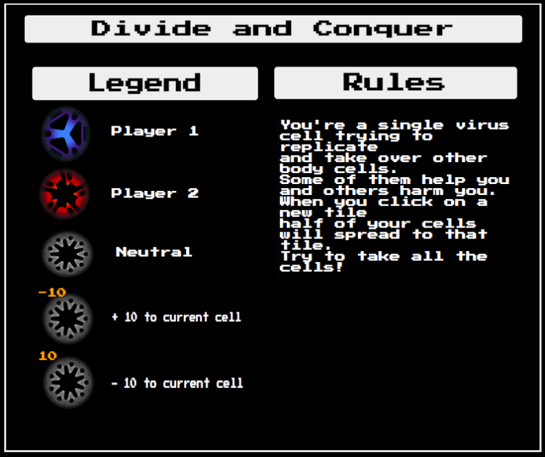

# 

## A game about splitting in half to take control of other cells

Take control of all the cells on the board by clicking an adjacent cell to send half of your army there. Some of the cells you'll encounter will help and add to your total body count and other will hurt and subtract.

When you encounter an enemy you two will battle it by subtracting the amount of cells sent over!

The game can be played [here](https://karinchung.github.io/risk/)

## Technologies
Divide and Conquer uses HTML, CSS, Javascript, and jQuery.

## User Stories
* I'd like to see who's turn it is so I don't have to remember
* Cool graphics so I'm not bored
* A legend so I know what I'm doing and why
* States for when I'm clicking or hovering so I can see what I'm doing
* Show me where I'm allowed to move to so I don't just click around lost

## MVP
* Clicking on a cell to move half it's value to another cell
* Battle function to win over other cells
* Win display

## Nice to Haves
* Reset button
* Splash page to host this game and another game that's points based
* Fix breakpoints for tablet and mobile
* Tie movement to keys

## Bugs being worked on
* If you have a cell with 1 in it, instead of going away, it divides into two cells with 1 in both of them

## Credit
Images from Jason Moran, 3D artist. His website can be found [here](http://jasonmoran3d.com/)

Popup modal from an MIT open source plugin found [here](http://dev.vast.com/jquery-popup-overlay/)
